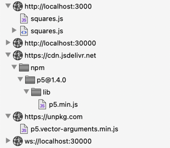
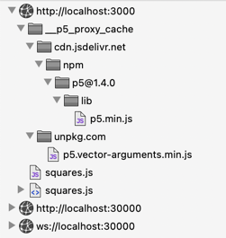

# Proxy Cache

p5-server caches requests to known Content Delivery Network (CDN) servers.

If a sketch uses libraries from these locations – as the files that p5-server
generates do — and if you first view a sketch (or any sketch that uses the same
libraries) while your computer has internet service, you can run it later while
your computer is offline.

(This feature, or a server that provides this feature, are variously referred to
on the web as a *proxy cache*, a *reverse proxy cache*, a *caching proxy*, or a
*web accelerator*.)

Without the proxy cache:

With the proxy cache:

## How to Use the Cache

The proxy cache is enabled by default. To use it, simply browse your sketches
while your computer is connected the internet. This loads any CDN files that are
necessary to run the sketches that you view. At any later point, you can view
the same sketches without an internet connection.

The `p5 cache warm` command can also be used to pre-load the cache with import
paths for p5.js and its community libraries, and with the CSS frameworks and
other helpers that the p5 server itself uses.

## Disabling the Cache

To run the server without the cache, run the `p5 server` command with the `--no-cdn-cache` option.

The files created by `p5 build` and `p5 generate` do not reference the CDN
servers directly, and do not depend on the cache. The cache is only used when
running `p5 server`.

## What is Cached?

Requests for NPM packages from the JSDelivr, Skypack, and Unpkg content delivery
networks are cached, as are resources from `fonts.googleapis.com`,
`fonts.gstatic.com`, and `ghcdn.rawgit.org`.

Import paths from the community p5.js libraries are also cached. Most of these
paths are either NPM packages or are served from `ghcdn.rawgit.org`, and would
be cached in any case. A few of the community libraries are served from servers
that are specific to those libraries or the organizations that public them; this
ensures that they are cached as well.

## Command Line

The `p5 cache` subcommand can be used to inspect and manipulate the cache:

**`p5 cache clear`** removes all entries from the cache.

**`p5 cache info`** prints information about the cache.

**`p5 cache ls`** lists the cache entries.

**`p5 cache path`** prints the path to the cache.

**`p5 cache warm`** “warms” the cache, by loading it with requests for p5.js and
community libraries.

Many of these commands take options. Use `--help` to see these; for example, `p5
cache ls --help`.

## Implementation Details

In HTML documents served by the server, `script` element `src` attributes and
`link` element `href` attributes whose values are CDN resources, are rewritten
as requests against the development server.

In CSS documents, URLs that resolve to CDN resources are also rewritten. This
ensures that if the HTML for a sketch links to a CSS document that in turn
includes other CSS documents or other assets (such as fonts or images), these
assets are also cached.

A request for `https://cdn.jsdelivr.net/npm/p5@1.4.0/lib/p5.min.js`, for
example, is rewritten as a request for
`__p5_proxy_cache/cdn.jsdelivr.net/npm/p5@1.4.0/lib/p5.min.js`. A request for
`https://unpkg.com/p5.vector-arguments.min.js` is rewritten as
`__p5_proxy_cache/unpkg.com/p5.vector-arguments.min.js`. This naming scheme was
selected to make the source list of the browser's developer console readable (as
illustrated in the screenshot at the top of this document).

The cache is stored on disk at `~/.cache/p5-server`.

## Limitations

Resources in the cache are not currently checked for expiration. This is
probably okay for the accepted use of the cache, since the cached resources
should not change. In order to force the cache to re-fill, it is currently
necessary to run `p5 cache clear` followed by `p5 cache warm`.
